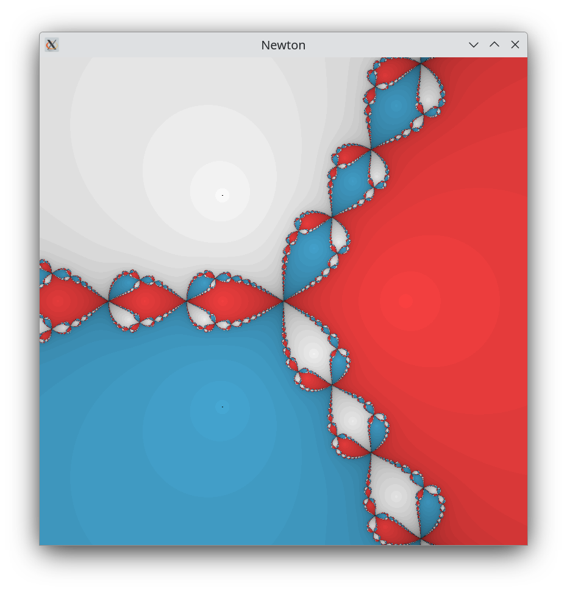

# Newton Method 

The Newton-Raphson method is a iterative alogorithm to find roots given a function $f(x)$, its derivative $f'(x)$ and a starting estimate $x_0$. The method is to use where the tanget line from the current estimate $x_n$ crosses the x axis as the next estimate $x_{n+1}$.

$f'(x)$ is the gradient of the tangent line $g_n(x)$ at $x_n$,

$g_n(x) = f'(x_n)x + c$,

the tangent line passes through $(x_n, f(x_n))$,

$f(x_n) = f'(x_n)x_n + c$,

$c = f(x_n) - f'(x_n)x_n$,

$g_n(x) = f'(x_n)x + f(x_n) - f'(x_n)x_n$,

$g_n(x) = f'(x_n)(x - x_n) + f(x_n)$

substituting $(x_{n+1}, 0)$,

$0 = f'(x_n)(x_{n+1} - x_n) + f(x_n)$

$x_{n+1} = x_n - \frac{f(x_n)}{f'(x_n)}$

This final formula is the Newton-Raphson method for finding a functions root. The fractals emerge in recording how long it takes to find the root(within a margin). Setting the screen as the 2d complex plane the color of a pixel can be set by associating colors with roots and intensity with iteration count.

The picture below is the fractal generated by $f(z) = z^3 - 1$, the small black dots are the specail case when no iterations are needed(however black is also the color of divergence), the three cube roots of 1, $0 = z^3 - 1 \iff 1 = z^3 \iff 1 = \sqrt[3]{z}$
