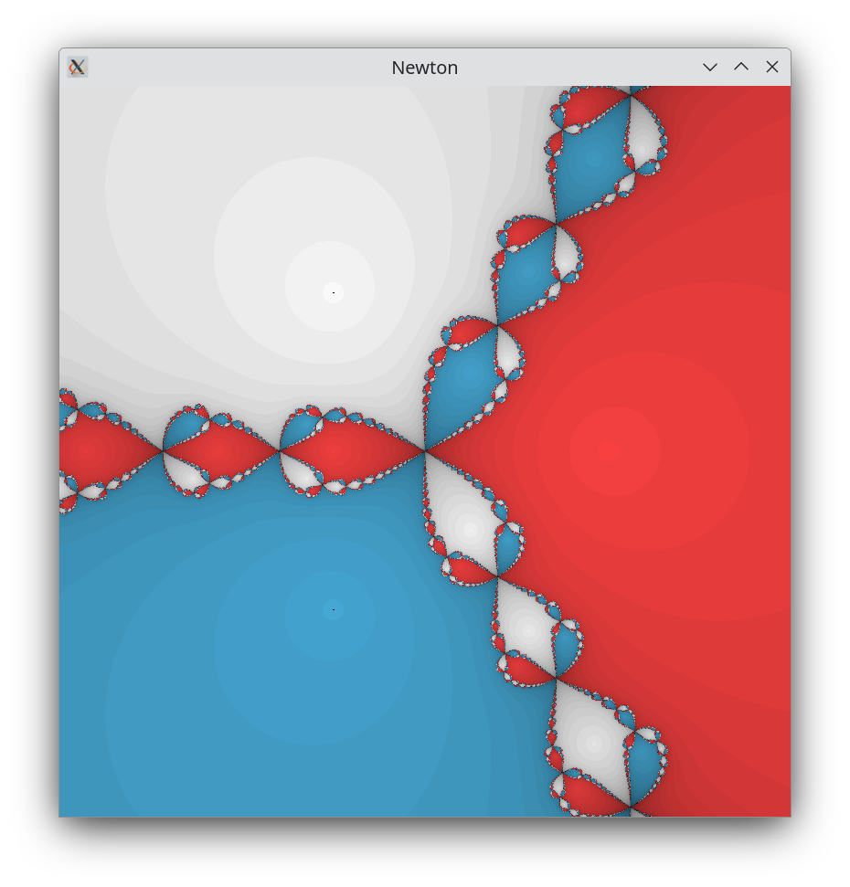

# Fractals
A collection of pretty fractal renders, each folder has individual readme explaining the process. A lot of the code is repeated boilerplate but it's simpler to copy then make one master program.

# Mandelbrot Set
The complex plane colored by the behavior of a iterative fucntion.

***

# Julia Set
Mandel with a sligthly different function.

***

# Newton Fractal
The complex plane colored by the behaivor of the Newton-Raphson method on a given function.

***

### Requirements

- glfw3