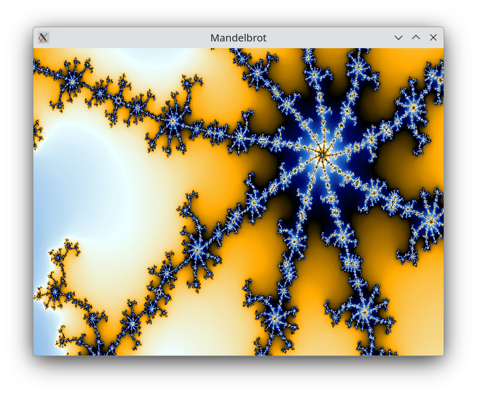

# Fractals
A collection of pretty fractal renders

# Mandelbrot Set
The set of $c$ for which the repeated application of  function $f(z) = z^2 + c$ does not diverge. The screen will represent the 2D complex plane with $x$ being real and $y$ imaginary, each pixel $c\in\Complex$, $c =x + yi$ will be used as the constant in $f(z)$, the number of interations or "escape time" until divergance will be used to colour the pixel.

To do this quickly I will use GLSL shaders to compute each pixel's escape time so that they can be done in parallel.

Substituting $z = x_1 + y_1i$ and $c = x_2 + y_2i$ into 
$f(z) = z^2 + c$ gives: 

$f(z) = (x_1 + y_1i)^2 + x_2 + y_2i$

$f(z) = x_1^2 + 2x_1y_1i - y_1^2 + x_2 + y_2i$ 

$Re(f(z)) = x_1^2 - y_1^2 + x_2$

$Im(f(z)) = 2x_1y_1 + y_2$

Starting at $z_0 = 0 + 0i$ a point is in the set if and only if 

$|z_n| < 2 = x_n^2 + y_n^2 < 4, \forall n \in \N$ 

To color I will take color palette in [this](https://stackoverflow.com/a/25816111) stackoverflow answer and linearly interpolate using escape time. To make the coloring smoother I take $ln(ln(|z|))$ from the iteration count and increase the escape radius, this reduces colors "banding".

[Algortithm shader implementation](Mandelbrot/shaders/m.frag)

***
### Requirements

* glfw3